  

 

  <em>
    Full-stack JavaScript/TypeScript developer from the Netherlands with 27+ years in tech. 
    Building with React, Vue, Node.js and NestJS. 
    Brewing beer, shooting photos, and figuring out life along the way.
  </em>

 

  
  

 

## Recent [Nano Posts](https://github.com/jeroenvanwissen/nanopost)

- `26 Feb 2026` [But you can use the configured editor to edit the body](https://jeroenvanwissen.github.io/2026/02/26/but-you-can-use-the-configured-editor-to-edit-the-body.html)
- `26 Feb 2026` [The interactive mode of nanopost works quite nice](https://jeroenvanwissen.github.io/2026/02/26/the-interactive-mode-of-nanopost-works-q.html)
- `26 Feb 2026` [Were getting close to a nice working theme and implementation.](https://jeroenvanwissen.github.io/2026/02/26/were-getting-close-to-a-nice-working-the.html)
- `25 Feb 2026` [diff –git a/.nanopost/config.json b/.nanopost/config.json](https://jeroenvanwissen.github.io/2026/02/25/diff-git-a-nanopost-config-json-b-nanopost-config-json.html)
- `25 Feb 2026` [Created this page to test out 2 projects….](https://jeroenvanwissen.github.io/2026/02/25/created-this-page-to-test-out-2-projects-the-nanopost-cli-to.html)

 

---

  
  
  
  
  
  

  This profile is generated with ❤️ by a <a href=".github/workflows/generate-readme.yml">GitHub Action</a>

