  

 

  <em>
    Full-stack JavaScript/TypeScript developer from the Netherlands with 27+ years in tech. 
    Building with React, Vue, Node.js and NestJS. 
    Brewing beer, shooting photos, and figuring out life along the way.
  </em>

 

  
  

 

  
  

 

---

  
  
  
  
  
  

  This profile is generated with ❤️ by a <a href=".github/workflows/generate-readme.yml">GitHub Action</a>

